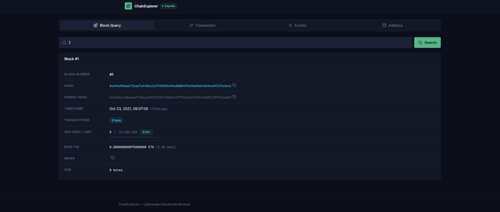
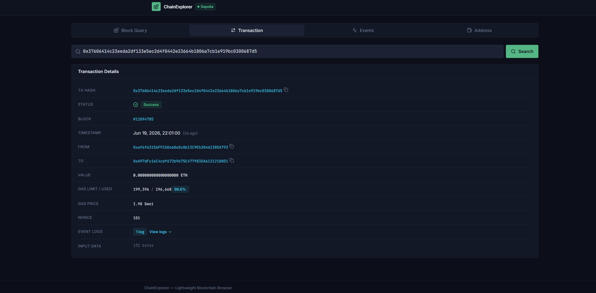
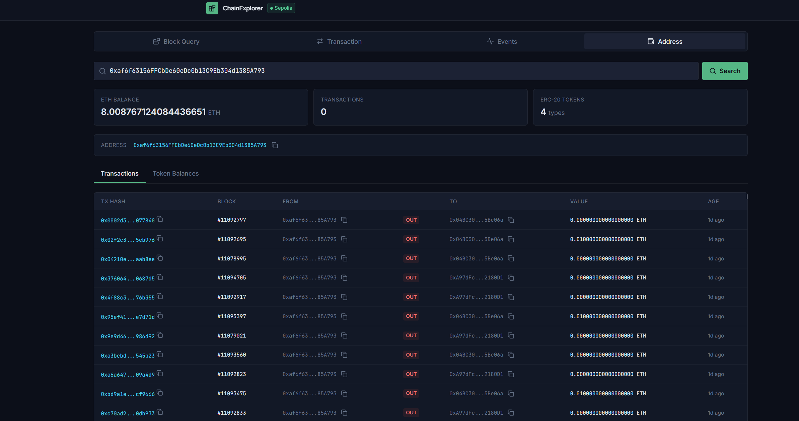
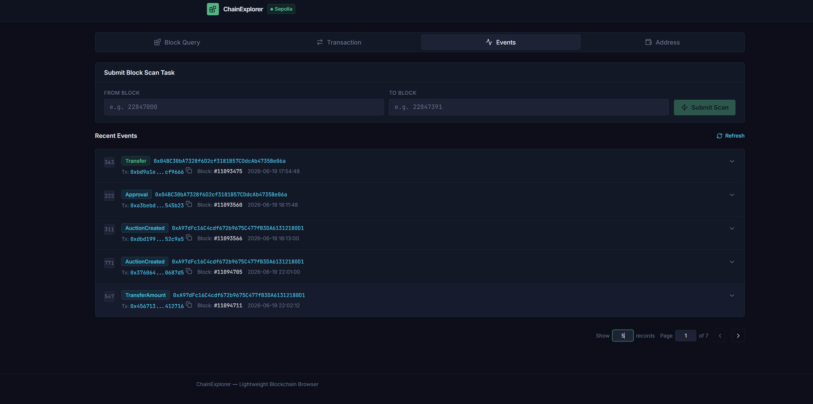

# etherscan

提供简单区块链链上信息查询、同步

## 项目结构

```shell
.
├── README.md                           # 本文件
├── abi                                 # abi元数据
│   └── ERC20.json                # 标准ERC20的ABI结构，用于查询ERC20相关信息
├── api                                 # api定义文件
│   ├── balance.api               # 余额相关API定义
│   ├── block.api                 # 区块相关API
│   └── transaction.api           # 交易相关API
├── ddl                                 # DB ddl文件
├── docker                              # 依赖中间件的docker-compose
├── docs                                # go-zeo根据api生成的接口文档
├── etc                                 # 配置文件，yaml格式，可配合${ENV_KEY_VALUE}使用
├── etherscan.api                       # api顶层定义文件，通过import导入不同组的api
├── etherscan.go                        # 入口文件
├── internal                            # 服务主要逻辑, internal定义，防止外部不正当调用
│   ├── config                    # 配置相关逻辑和结构体定义
│   └── handler                   # 路由相关
        ├── routes.go             # api路由，go-zero生成
        ├── static_router.go      # 前端静态资源路由
        └── v1                    # api路由http handler入口文件，go-zero生成
│   ├── logic                     # 接口逻辑
│   ├── model                     # DB层
│   ├── svc                       # 服务全局状态管理
│   └── types                     # 公共结构体，go-zero生成
└── pkg                                 # 工具包或第三方工具包装
    ├── contracts                       # 合约相关工具，如：abigen生成的bind内容
    ├── ethx                            # 包装的ethclient
    ├── limiter                         # 限流器
    └── utils                           # 纯工具方法
├── web                                 # 前端部分，可以独立开发、运行，也可以打包后，通过后端反向代理静态资源运行
```

## 项目功能

1. **区块查询**
    - 根据区块号或哈希，返回：
        - 区块号、哈希、父哈希、时间戳
        - 交易数量、Gas 使用情况等简要信息


2. **交易查询**
    - 根据交易哈希，返回：
        - from / to / value / gas / input data
        - 回执中的 status / gasUsed / logs 数量等


3. **地址视图**：
    - 查看某地址最近参与的交易列表
    - 查看地址当前 ETH 、ERC20代币余额


4. **地址视图**：
    - 查看某地址最近参与的交易列表
    - 查看地址当前 ETH 、ERC20代币余额


5. **交易事件查询&拉取**：
    - 查看最近发生的交易事件
    - 提交交易拉取任务


6. **事件监听**
    - 背景协程订阅配置合约的事件
    - 将最近 N 条事件保存在`MySQL`中
    - 提供接口查看最近事件列表
    - 提供接口提交区块扫描任务

7. **历史扫描**：
    - 程序启动时，从指定高度回放扫描一定区间的历史区块的交易、事件

8. **持久化存储**：
    - 将事件写入`MySQL`，并支持分页查询

---

# Quick Start

推荐前端代码打包后，直接运行golang服务，可同时运行前端+api服务

运行后，访问服务根路由即是访问前端页面
```shell
# etc/etherscan-api.yaml配置端口
# 浏览器直接访问http://localhost:8080，就可以进入前端页面
Port: 8080
```


## Backend

### 1. 拉取依赖

```shell
go mod tidy && go mod vendor
```

### 2. 配置

在`etc`目录下查看所有配置说明，补充需要的配置信息

### 3. 启动MySQL

通过`docker`启动`mysql`
```shell
docker-compose -f docker/docker-compose.yaml up -d
```
> 如果已有mysql实例，此步省略，在配置文件中配置mysql地址即可

### 4. 启动项目

```shell
go run etherscan.go
```

---

### 开发流程

#### 前置

安装`go 1.24+`

安装`goctl`
```shell
go install github.com/zeromicro/go-zero/tools/goctl@latest
```

安装`abigen`
```shell
go iinstall github.com/ethereum/go-ethereum/cmd/abigen@latest
```

#### 编码

API接口改动：
1. 在`api`目录下定义接口
```api
@doc "获取某个地址的ETH、ERC20代币余额，若TokenAddress未传，则获取ETH余额"
@handler GetBalance
get /balances (GetBalanceReq) returns (Response)
```

2. 执行命令生成api命令
```shell
# etherscan.api导入了api/下的所有api
goctl api go --api etherscan.api --dir . --style go_zero
```
会在`internal/logic/v1/balance/get_balance_logic.go`位置生成接口逻辑代码

3. 在`internal/logic`下找到api中定义的接口文件，编写接口逻辑即可
```go
func (l *GetBalanceLogic) GetBalance(req *types.GetBalanceReq) (resp *types.Response, err error) {
	// todo: write your logic code here
	return
}
```

---

## Frontend

参考[FRONTEND.md](web/README.md)
